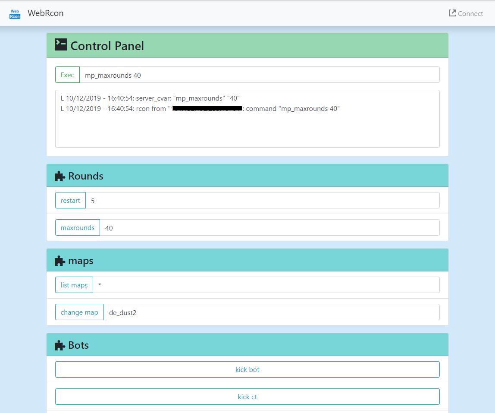

# WEBRCON-Server

A web based control panel for srcds' RCON protocol (CS:GO).



## Usage

## Flags

```
Usage of webrcon-server:
  -addr address
        address of the server RCON, in the format of HOST:PORT. (default "127.0.0.1:27015")
  -admin-name username
        basicauth username for path /api/exec
  -admin-pass password
        basicauth password for path /api/exec
  -bind address
        webrcon-server bind address (default "0.0.0.0:8080")
  -conf file
        load configs from file instead of flags.
  -pass password
        password of the RCON.
  -timeout timeout
        timeout of the connection (seconds). (default 1)
```

### API

1. exec

    ```
    curl -X POST 127.0.0.1:8080/api/exec -H "Content-Type: application/json" -d '{"cmd":"YOUR_CMD_HERE"}'
    ```

    or

    ```
    curl -v -X GET '127.0.0.1:8080/api/exec?cmd=YOUR_CMD_HERE'
    ```

2. connect

    Visit `127.0.0.1:8080/api/connect`, you will be 301 redired to steam game launching shortcut.

### GUI

Browse to `http://127.0.0.1:8080/`

Please help us to add more command shortcut.

In resources/main.js, edit the object

```
shortcutGroups: {
    "Rounds": [
        { id: 1, args: true, default: "5", name: "restart", cmd: "mp_restartgame" },
        { id: 2, args: true, default: "30", name: "maxrounds", cmd: "mp_maxrounds" },
    ],
    "Bots": [
        { id: 1, args: false, default: "", name: "kick bot", cmd: "bot_kick" },
        { id: 2, args: false, default: "", name: "kick ct", cmd: "bot_kick ct" },
        { id: 3, args: false, default: "", name: "kick t", cmd: "bot_kick t" },
        { id: 4, args: false, default: "", name: "add ct", cmd: "bot_add_ct" },
        { id: 5, args: false, default: "", name: "add t", cmd: "bot_add_t" },
    ],
    "Cheats": [
        { id: 1, args: false, default: "", name: "cheat on", cmd: "sv_cheats 1" },
        { id: 2, args: false, default: "", name: "cheat off", cmd: "sv_cheats 0" },
    ]
}
```